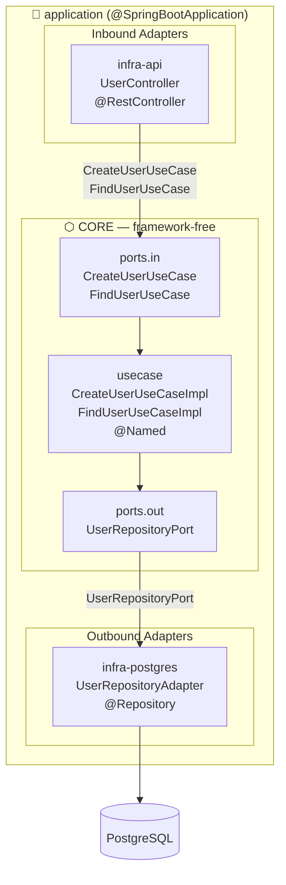

# Architecture Overview — poc-template

> **Quick-start for AI agents:** Read `AGENT.md` for strict coding rules. This file is the narrative companion.

---

## The Hexagon



---

## Module Map

| Module | Technology | Role |
|---|---|---|
| `core` | Java 21 std + jakarta.inject | Business rules, domain model, port contracts |
| `infra-api` | Spring Web MVC + MapStruct | REST inbound adapter (Controllers + DTOs) |
| `infra-postgres` | Spring Data JPA + Hibernate + Lombok | Relational persistence outbound adapter |
| `application` | Spring Boot 3.5.0 | Bootstrapper — wires all modules + `application.yml` |

---

## Data-Flow Walkthrough: `POST /api/v1/users`

```
HTTP Request
    │
    ▼
UserController.create(@RequestBody CreateUserRequest)   [infra-api]
    │  uses UserApiMapper.toResponse()
    │
    ▼
CreateUserUseCase.execute(name, email)                  [core — port contract]
    │
    ▼
CreateUserUseCaseImpl.execute(name, email)              [core — @Named impl]
    │  checks UserRepositoryPort.existsByEmail()
    │  calls   UserRepositoryPort.save(User)
    │
    └──▶ UserRepositoryAdapter.save()                   [infra-postgres]
            UserPostgresMapper: User → UserEntity → save → User
    │
    ▼
UserController returns UserResponse (201 Created)
```

### `GET /api/v1/users/{id}`

```
FindUserUseCaseImpl.execute(id)
    │
    └──▶ UserRepositoryPort.findById(id) → return User (or throw if not found)
```

---

## Naming Conventions

| Suffix | Module | Type | Spring annotation |
|---|---|---|---|
| `UseCase` | `core.ports.in` | `interface` | — |
| `UseCaseImpl` | `core.usecase` | `class` | `@Named` (jakarta) |
| `Port` | `core.ports.out` | `interface` | — |
| `Adapter` | `infra-*` outbound | `class` | `@Repository` / `@Component` |
| `Controller` | `infra-api` | `class` | `@RestController` |
| `Mapper` | `infra-*` mapper pkg | `interface` | `@Mapper(componentModel = SPRING)` |
| `Entity` | `infra-postgres` | `class` | `@Entity` |

---

## Key Architecture Rules

1. **`core` is framework-free** — only `jakarta.inject-api` allowed. No `org.springframework.*`, no `jakarta.persistence.*`, no Jackson.
2. **`@Named` not `@Component`** — use `jakarta.inject.Named` on all `*UseCaseImpl` classes for portable bean discovery.
3. **Constructor injection only** — single constructor with `final` fields; no `@Inject` / `@Autowired` in `core`.
4. **Mappers live in `infra-*`** — always in the `*.mapper` package with `@Mapper(componentModel = SPRING)`.
5. **No extra interfaces on adapters** — `UserRepositoryAdapter` implements `UserRepositoryPort` directly; no `IUserRepositoryAdapter`.
6. **No interfaces on inbound adapters** — `UserController` is a concrete class only.
7. **Lombok scoped to `infra-postgres` only** — JPA entities need mutable boilerplate; all other layers use records or plain classes.

---

## How to Add a New Feature (Blueprint Checklist)

Follow this exact order — do not skip steps or create files out of sequence:

```
[ ] 1. core / domain        — add pure domain record/class (zero annotations)
[ ] 2. core / ports.out     — add *Port interface(s) the use case needs
[ ] 3. core / ports.in      — add *UseCase interface
[ ] 4. core / usecase       — add *UseCaseImpl (@Named, clean constructor)
[ ] 5. infra-postgres       — add *Entity, extend JpaRepository, add *Mapper, add *Adapter
[ ] 6. infra-api            — add Request/Response records, *Mapper, *Controller
```

> **Violation check:** if any infra class imports from `core.domain` without going through a port, or if `core` imports `org.springframework.*`, stop and flag the inconsistency.

---

## Configuration Reference

| Property | Default | Env var override |
|---|---|---|
| `spring.datasource.url` | `jdbc:postgresql://localhost:5432/poc_template` | — |
| `spring.datasource.username` | `postgres` | `DB_USERNAME` |
| `spring.datasource.password` | `postgres` | `DB_PASSWORD` |
| `server.port` | `8080` | — |
